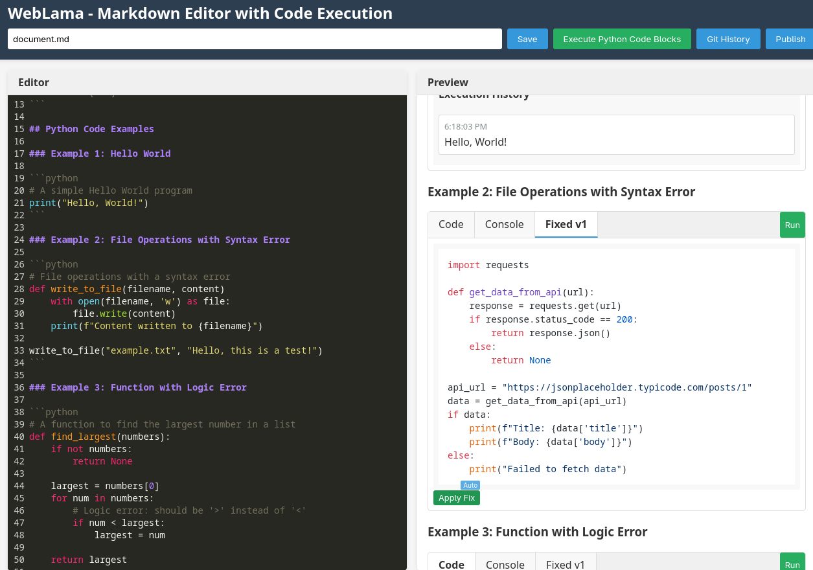

# WebLama

a sleek and feature-rich frontend web application designed to work seamlessly with the #PyLama based on #Ollama ecosystem for developers, educators, and technical writers, 

🚀 WebLama is a Frontend for the #PyLama, brings together markdown editing, code highlighting, and Mermaid diagram support in one intuitive interface.

- ✨ Rich Markdown Editor with syntax highlighting for Python, JavaScript, SQL, Java, and more  
- 🔁 Live Preview – see your Markdown rendered in real time  
- 📊 Mermaid Diagram Support – create flowcharts, sequence diagrams, and more using Mermaid syntax  
- 💻 Responsive Design – works beautifully on desktop and mobile  
- 🗂️ File Explorer – browse and manage your Markdown files with ease  
- ⚙️ Integration with APILama – connects to backend services via the APILama gateway  


#WebLama #PyLama #MarkdownEditor #MermaidJS #FrontendDev #OpenSource


A frontend web application for the PyLama ecosystem with syntax highlighting, Mermaid diagram support, and markdown rendering capabilities.



## Features

- **Rich Markdown Editor**: Syntax highlighting for various languages including Python, JavaScript, SQL, and Java
- **Live Preview**: Real-time rendering of Markdown content with syntax highlighting
- **Mermaid Diagram Support**: Create and visualize diagrams using Mermaid syntax
- **Code Display**: Display code with syntax highlighting
- **Responsive Design**: Works on desktop and mobile devices
- **File Explorer**: Browse and manage markdown files
- **Integration with APILama**: Communicates with backend services through the APILama gateway

## Installation

### Using npm

```bash
# Clone the repository
git clone https://github.com/py-lama/pylama.git
cd py-lama/weblama

# Install dependencies
npm install
```

### Using Docker

```bash
# Build the Docker image
docker build -t weblama .

# Run the container
docker run -p 8081:80 weblama
```

## Usage

**WebLama is a frontend web application that communicates with the APILama backend.**

### Using the WebLama CLI

WebLama now includes a command-line interface (CLI) tool for easier management:

```bash
# Show help and available commands
weblama --help

# Start the WebLama frontend server
weblama start

# Start with custom port and API URL
weblama start --port 8090 --api-url http://localhost:8080

# Start and automatically open in browser
weblama start --open

# Check if APILama is running
weblama health

# List all markdown files
weblama list
```

The CLI tool will start a web server and inject the API URL into the HTML, ensuring proper communication with the APILama backend.

### Using npm directly

You can also start WebLama using npm:

```bash
# Start using npm
npm start
```

This will start a web server on port 8081 by default. You can access the WebLama interface by opening your browser and navigating to:

```
http://localhost:8081
```

You can customize the port by setting the PORT environment variable:

```bash
# Start on a custom port
PORT=8090 npm start
```

### Environment Variables

- `PORT`: The port to run the web server on (default: 8081)
- `API_URL`: The URL of the APILama backend (default: http://localhost:8080)

You can set these variables in a `.env` file or pass them directly when starting the server.

## Makefile Usage

You can use the included `Makefile` for common tasks:

- **Set up the project (installs npm dependencies):**
  ```bash
  make setup
  ```

- **Start the Web UI on port 8081 (default):**
  ```bash
  make web
  ```
  This starts the WebLama web application. Open your browser at http://localhost:8081

- **Start the Web UI on a custom port:**
  ```bash
  make web PORT=8090
  ```
  This starts the app on port 8090. The PORT environment variable is used to configure the server.

- **Build the static assets:**
  ```bash
  make build
  ```
  This creates a `dist` directory with all the static assets ready for deployment.

- **Run linting:**
  ```bash
  make lint
  ```

- **Run tests:**
  ```bash
  make test
  ```

**Note:** WebLama is now a frontend-only component that communicates with the APILama backend API gateway.

## Markdown Files

WebLama looks for markdown files in the `markdown` directory located at:

```
/home/tom/github/py-lama/weblama/markdown/
```

If you don't see any files when you first start WebLama, you may need to create some markdown files in this directory. Two sample files are included:

1. `welcome.md` - A basic introduction with a Python code example
2. `mermaid_example.md` - Examples of Mermaid diagrams

You can add your own markdown files to this directory, and they will appear in the WebLama interface.

## Dependencies

- **Axios**: HTTP client for API requests
- **CodeMirror**: Rich text editor with syntax highlighting
- **Marked**: Markdown parser
- **Highlight.js**: Syntax highlighting for the preview
- **Mermaid**: Diagram visualization
- **HTTP-Server**: Static file server for development and production

## How It Works

1. **Frontend Architecture**:
   - WebLama is a pure frontend application built with HTML, CSS, and JavaScript
   - It communicates with the APILama backend via RESTful API calls
   - The editor uses CodeMirror for syntax highlighting and editing capabilities
   - Markdown content is rendered using Marked.js with syntax highlighting

2. **File Management**:
   - Files are loaded from and saved to the server via API calls to APILama
   - The file explorer displays available markdown files
   - Users can create, edit, and delete files through the interface

3. **API Integration**:
   - All backend operations (file operations, shell commands, etc.) are performed via API calls
   - The application uses Axios to make HTTP requests to the APILama gateway
   - APILama routes these requests to the appropriate backend services

## Development

### Project Structure

```
weblama/
├── package.json       # npm package configuration
├── bin/               # Command-line tools
│   └── weblama-cli.js # WebLama CLI tool
├── static/            # Static assets
│   ├── index.html     # Main HTML page
│   ├── css/           # Stylesheets
│   │   └── style.css  # Main stylesheet
│   └── js/            # JavaScript files
│       ├── editor.js  # Editor functionality
│       └── file_explorer.js # File explorer functionality
├── Dockerfile        # Docker configuration
├── nginx.conf        # Nginx configuration for Docker
├── .env.example      # Example environment variables
├── Makefile          # Make commands for common tasks
└── README.md         # This file
```

### Running Tests

```bash
pytest tests/
```

## Contributing

Contributions are welcome! Please feel free to submit a Pull Request.

1. Fork the repository
2. Create your feature branch (`git checkout -b feature/amazing-feature`)
3. Commit your changes (`git commit -m 'Add some amazing feature'`)
4. Push to the branch (`git push origin feature/amazing-feature`)
5. Open a Pull Request
