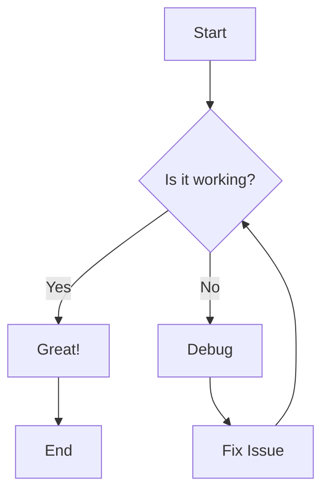

# WebLama Markdown Editor

## Mermaid Diagram Example



## Python Code Examples

### Example 1: Hello World

```python
# A simple Hello World program
print("Hello, World!")
```

### Example 2: File Operations with Syntax Error

```python
"""
File I/O example
"""
def write_to_file(filename, content):
    """Write content to a file."""
    with open(filename, 'w') as file:
        file.write(content)
    print(f"Content written to {filename}")
def read_from_file(filename):
    """Read content from a file."""
    try:
        with open(filename, 'r') as file:
            content = file.read()
        print(f"Content read from {filename}")
        return content
    except FileNotFoundError:
        print(f"File {filename} not found")
        return None
if __name__ == '__main__':
    # Write to a file
    write_to_file('example.txt', 'Hello, World!\nThis is a sample file.')
    # Read from the file
    content = read_from_file('example.txt')
    if content:
        print("File content:")
        print(content)
```

### Example 3: Function with Logic Error

```python
# A function to find the largest number in a list
def find_largest(numbers):
    if not numbers:
        return None
    
    largest = numbers[0]
    for num in numbers:
        # Logic error: should be '>' instead of '<'
        if num < largest:
            largest = num
    
    return largest

# Test the function
numbers = [5, 10, 3, 8, 15]
result = find_largest(numbers)
print(f"The largest number is: {result}")
```

### Example 4: API Request with Missing Import

```python

def get_data_from_api(url):
    """Get data from an API."""
    try:
        response = requests.get(url)
        response.raise_for_status()  # Raise an exception for HTTP errors
        return response.json()
    except requests.exceptions.RequestException as e:
        print(f"Error making API request: {e}")
        return None
```
