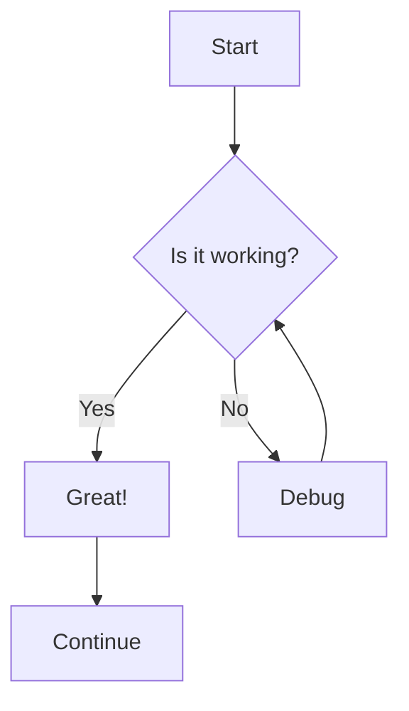
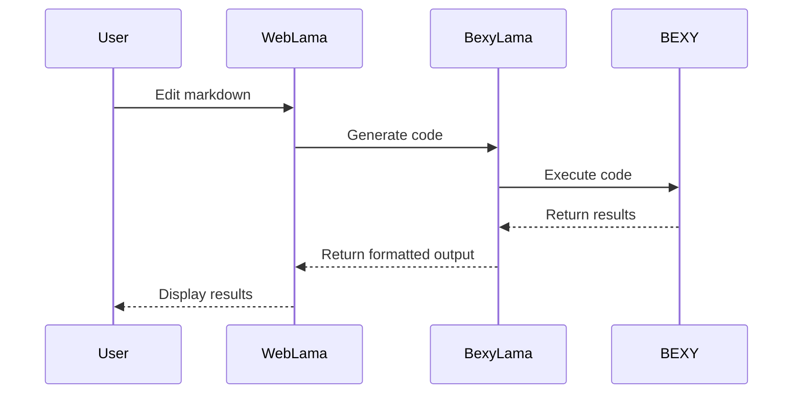
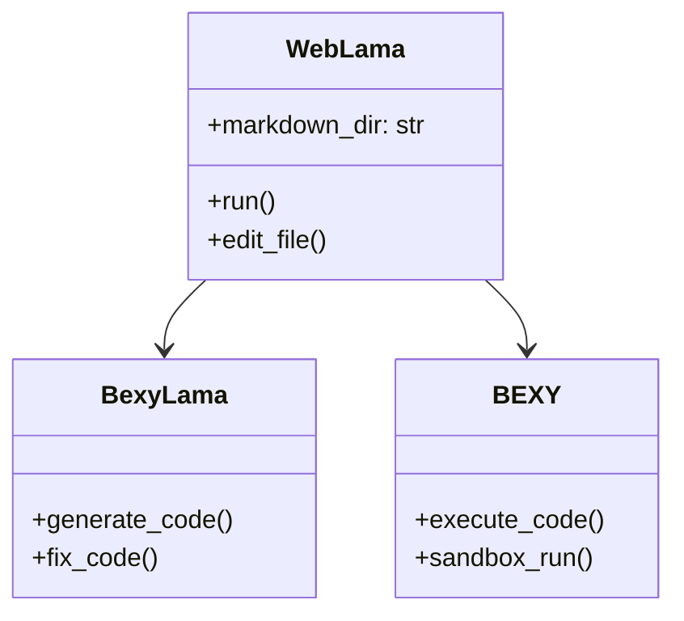

# Mermaid Diagram Examples

This file demonstrates WebLama's support for Mermaid diagrams.

## Flow Chart

## Sequence Diagram

## Class Diagram

## Try Your Own

You can edit this file to create your own Mermaid diagrams. WebLama will render them in real-time!
