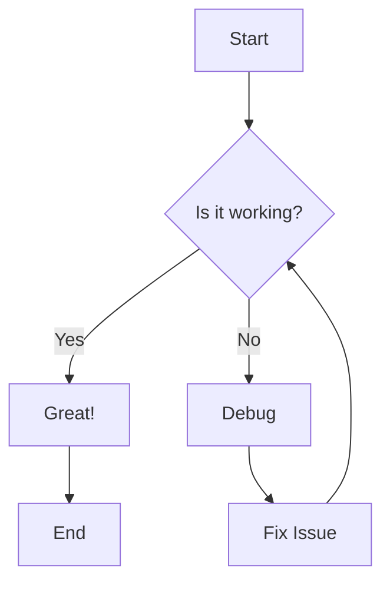

# WebLama Markdown Editor

## Mermaid Diagram Example



## Python Code Examples

### Example 1: Hello World

```python
# A simple Hello World program
print("Hello, World!")
```

### Example 2: File Operations with Syntax Error

```python
# File operations with a syntax error
def write_to_file(filename, content)
    with open(filename, 'w') as file:
        file.write(content)
    print(f"Content written to {filename}")


write_to_file("../example.txt", "Hello, this is a test!")
```

### Example 3: Function with Logic Error

```python
# A function to find the largest number in a list
def find_largest(numbers):
    if not numbers:
        return None
    
    largest = numbers[0]
    for num in numbers:
        # Logic error: should be '>' instead of '<'
        if num < largest:
            largest = num
    
    return largest

# Test the function
numbers = [5, 10, 3, 8, 15]
result = find_largest(numbers)
print(f"The largest number is: {result}")
```

### Example 4: API Request with Missing Import

```python
# API request example with missing import

def get_data_from_api(url):
    response = requests.get(url)
    if response.status_code == 200:
        return response.json()
    else:
        return None

api_url = "https://jsonplaceholder.typicode.com/posts/1"
data = get_data_from_api(api_url)
if data:
    print(f"Title: {data['title']}")
    print(f"Body: {data['body']}")
else:
    print("Failed to fetch data")
```
